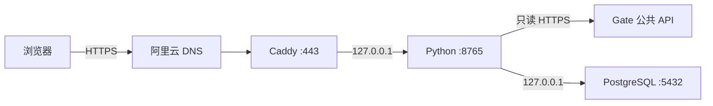

# Gate 行情监控：AI 项目知识库

最后核验：2026-07-28（Asia/Shanghai）

这份文件是下一位 AI 的主入口。目标是让新的对话不需要重新探索 AWS、
服务器、数据库和代码架构，就能安全接手。

## 1. 一分钟结论

这是一个只读行情监控网站：

- 生产地址：`https://sheshetrip.fun`
- 数据源：Gate 公共 API，不使用 Gate API Key，不读取账户，不会下单
- 品种：XAUUSD 黄金 CFD、BTC_USDT 永续
- 后端：Python 3.12，自带 `ThreadingHTTPServer`
- 反向代理与 HTTPS：Caddy
- 数据库：同机 PostgreSQL 16
- 登录：PostgreSQL 用户、scrypt 密码哈希、数据库会话
- 服务器：AWS Lightsail 东京区，USD 12/月

未登录只能看到登录页。仪表盘、业务 JavaScript、账户页面和行情 API 都需要
有效会话。

当前最重要的事实：

1. XAU/BTC 行情和 `SCALP-1.0-PY` 核心策略已经在 Python 后端。
2. 数据库目前真正保存用户和会话；策略历史表已建但仍是空表。
3. 浏览器里的模拟交易日志仍使用 `localStorage`，没有进数据库。
4. 当前没有 CDN、AWS WAF、IP 黑名单、IP 限流或 Fail2ban。
5. 不得把任何密码、Cookie、数据库连接串、AWS 凭据或 SSH 私钥写进文档。

## 2. 新 AI 的阅读顺序

先读本文件，再按任务选择：

1. AWS、服务器、DNS、部署：`aws/AI_HANDOFF.md`
2. 用户创建、停用、重置：`aws/USER_AUTH.md`
3. PostgreSQL 运维与迁移 RDS：`aws/POSTGRESQL_TO_RDS.md`
4. 普通使用与指标介绍：`README.md`
5. AWS 权限结构：`aws/README.md`

不要重新创建 AWS 身份、实例、静态 IP 或 Sites 项目。现有资源都已记录。

## 3. 生产架构



网络监听：

- Caddy：公网 TCP 80/443
- Python：仅 `127.0.0.1:8765`
- PostgreSQL：仅 `127.0.0.1:5432`
- SSH：TCP 22，仅允许记录的 Mac 出口 IP 和 Lightsail Connect

生产服务：

- `xau-monitor.service`
- `postgresql.service`
- `caddy.service`
- `xau-monitor-db-backup.timer`

以上服务在 2026-07-28 均为 active。

## 4. AWS 与域名现状

### Lightsail

- 区域：`ap-northeast-1`（东京）
- 可用区：`ap-northeast-1a`
- 实例名：`Ubuntu-1`
- 套餐：`small_3_0`
- 系统：Ubuntu 24.04
- CPU：2 vCPU
- 内存：2 GB
- SSD：60 GB
- 静态公网 IPv4：`<LIGHTSAIL_PUBLIC_IPV4>`
- 私网 IPv4：`<LIGHTSAIL_PRIVATE_IPV4>`
- 生产目录：`/opt/xau-monitor`
- 固定费用：USD 12/月，未含税
- Lightsail 自动快照：关闭

2026-07-28 实测根分区约 58 GB 可用容量，已使用约 2.4 GB，剩余约
55 GB。资源数字会变化，做容量判断前重新查询。

### 域名

- `sheshetrip.fun`：正式监控，要求登录
- `www.sheshetrip.fun`：同一服务，要求登录
- `chopsticktrip.com`：保留空白站点，HTTPS 返回空 HTTP 200
- `www.chopsticktrip.com`：同上

阿里云 DNS 的 A 记录指向 `<LIGHTSAIL_PUBLIC_IPV4>`。HTTPS 证书由 Caddy 自动申请
和续期，不单独购买证书。

### Caddy

配置源文件：`aws/caddy/Caddyfile`

生产文件：`/etc/caddy/Caddyfile`

当前行为：

- HTTP 自动跳转 HTTPS
- `sheshetrip.fun` 反代到 `127.0.0.1:8765`
- 请求体上限 32 KiB
- HSTS、nosniff、DENY frame、no-referrer
- JSON 访问日志：`/var/log/caddy/sheshetrip-access.log`
- 日志轮转：10 MiB、保留 5 份、最多 168 小时

## 5. 应用运行方式

生产 systemd 单元：`aws/systemd/xau-monitor.service`

核心启动命令：

```text
/opt/xau-monitor/.venv/bin/xau-monitor \
  --web \
  --host 127.0.0.1 \
  --port 8765 \
  --no-browser
```

systemd 从下面的 root-only 文件加载数据库连接：

```text
/etc/xau-monitor/database.env
```

禁止读取、打印、复制或上传该文件内容。

企业微信智能机器人已在代码中接入为可选长连接服务：

- CLI 参数：`--wecom-bot`
- 本地可与网页同进程运行：`xau-monitor --web --wecom-bot --no-browser`
- 生产建议使用单独 unit：`aws/systemd/xau-monitor-wecom-bot.service`
- 凭证文件：`/etc/xau-monitor/wecom-bot.env`
- 必需环境变量：`WECOM_BOT_ID`、`WECOM_BOT_SECRET`

禁止把 Bot Secret 写入代码、README、Git、日志或聊天。若 Secret 曾在聊天
或截图中暴露，正式部署前必须在企业微信后台重新随机生成。

机器人支持当天点位提醒：

- 指令：`黄金 今日点位 A B C D`，其中 `A B C D` 是用户当天实际点位
- 查看：`黄金 点位`
- 取消：`黄金 取消今日点位`
- 网页：主仪表盘“免费实时量能”下方的“机器人点位告警”面板可查看、覆盖
  保存或取消同一企业微信会话的今日点位
- 网页 API：`GET /api/bot/alerts`、`POST /api/bot/alerts`、
  `POST /api/bot/alerts/cancel`
- 存储：`app.price_alerts`
- 有效期：北京时间当天 24 点
- 告警：距离点位小于等于 3 美元，最多 2 次，默认两次至少间隔 60 秒
- 作废：从创建时价格所在一侧触达或穿过点位后，状态改为 `breached`
- 示例：创建时黄金现价 4000，点位 3997，价格到 3997 即作废；不是等到
  3996 或穿过 1 美元后才作废。

行情节奏：

- XAU 报价：约每 0.25 秒
- BTC 报价：约每 1 秒
- K 线、指标和策略：约每 5 秒
- 每个市场使用独立的 `MarketState`
- 行情和近期 Tick 只保存在 Python 内存

## 6. 数据与策略

### XAUUSD

使用 Gate TradFi 公共端点：

- `/api/v4/tradfi/symbols/XAUUSD/tickers`
- `/api/v4/tradfi/symbols/XAUUSD/klines`

黄金没有使用 COMEX 成交量。页面中的黄金量能参考 XAUT/PAXG 代理市场，
必须继续标注为代理量能，不能描述成 XAUUSD CFD 的真实成交量。

### BTC_USDT

使用 Gate USDT 永续公共端点：

- `/api/v4/futures/usdt/tickers`
- `/api/v4/futures/usdt/candlesticks`
- `/api/v4/futures/usdt/trades`

BTC 使用真实永续成交量、分钟 RVOL 和最近 60 秒主动买卖差。

### 后端指标与策略

后端负责：

- 1m/5m/15m EMA、RSI、ATR
- 日枢轴 P、R1/R2、S1/S2
- 多周期方向
- 关键位与区域聚类
- 5m/15m 趋势背景
- 1m sweep/reclaim
- 点差、追价、止损、止盈、盈亏比和有效期
- 量能加分
- 超短策略评分和状态

策略版本：

```text
SCALP-1.0-PY
```

策略入口：`src/xau_monitor/strategy.py:evaluate_scalp_strategy`

页面仍会为图表显示计算 EMA200、布林、ATR 通道、PSAR 等可视化叠加，并
把模拟交易日志保存在浏览器。这些属于显示/本机交互，不是服务端
`SCALP-1.0-PY` 的最终决策来源。

## 7. HTTP 路由与访问边界

公开：

- `GET /login`
- `GET /auth.css`
- `GET /auth.js`
- `GET /favicon.png`
- `POST /api/auth/login`

要求登录：

- `GET /`
- `GET /account`
- `GET /dashboard.js`
- `GET /dashboard.css`
- `GET /api/auth/me`
- `POST /api/auth/logout`
- `POST /api/auth/change-credentials`
- `GET /api/snapshot?market=xau|btc`
- `GET /api/quote?market=xau|btc`
- `GET /api/stream?market=xau|btc`

未登录网页请求返回 303 到 `/login`；未登录 API 请求返回 JSON HTTP 401。

登录和修改凭据的 POST 请求还检查 `Origin`。生产允许：

- `https://sheshetrip.fun`
- `https://www.sheshetrip.fun`

代码也保留了 `http://127.0.0.1:8765` 与 `http://localhost:8765` 供本地
开发，但 Secure Cookie 在纯 HTTP 下不会由正常浏览器持久保存。

## 8. 登录系统

实现：`src/xau_monitor/auth.py`

管理 CLI：`src/xau_monitor/users.py`

规则：

- 用户名：1–32 位 ASCII 字母、数字、点、横线、下划线
- 唯一性：Unicode NFKC 后 casefold
- 密码：12–128 个字符
- 密码哈希：scrypt，随机 Salt
- 会话期限：7 天
- Cookie：`__Host-sheshe_session`
- Cookie 属性：Secure、HttpOnly、SameSite=Strict、Path=/
- 数据库只保存会话 token 的 SHA-256 摘要
- 修改用户名或密码必须输入当前密码
- 修改成功后撤销该用户的其他会话
- 没有公开注册、邮件找回、MFA、角色或管理员网页

当前数据库账号：

- `owner`
- `j`
- `z`

只记录账号名，不要把密码写入项目。

凭据状态：

- `owner` 的随机初始密码保存在部署 Mac 登录钥匙串，服务名
  `sheshetrip.fun-user-login`、账户 `owner`
- `j` 和 `z` 的明文密码没有保存在 Mac；用户已经在聊天中收到
- 数据库只保存密码哈希，无法恢复任何明文密码
- 丢失 `j` 或 `z` 密码时只能使用管理 CLI 重置

当前按用户要求没有：

- IP 黑名单
- IP 请求限流
- Fail2ban
- AWS WAF
- CloudFront

登录日志中的 IP 和数据库 session IP 仅用于观察，不触发封禁。

## 9. PostgreSQL

版本：PostgreSQL 16.14

数据库：`xau_monitor`

应用角色：`xau_monitor`

权限：

- 非超级用户
- 不能创建数据库
- 不能创建角色
- 不能创建复制

Schema：`app`

迁移：

- `db/migrations/001_initial.sql`
- `db/migrations/002_auth.sql`

当前 schema version：2。

表：

- `app.schema_migrations`
- `app.strategy_snapshots`
- `app.users`
- `app.sessions`

当前真实持久化内容：

- 用户账号和密码哈希
- 有效登录会话
- Schema 版本

当前没有持久化：

- XAU/BTC Tick
- K 线
- 技术指标历史
- 策略信号历史
- 浏览器模拟交易日志

`app.strategy_snapshots` 已创建，但在 2026-07-28 仍为 0 行。

### 备份

- Timer：`xau-monitor-db-backup.timer`
- 时间：每天约 03:15 UTC（上海时间约 11:15）
- 格式：custom-format `pg_dump`
- 目录：`/var/backups/xau-monitor-postgresql`
- 保留：最近 7 天

重要限制：备份仍在同一台 Lightsail、同一块系统盘。这能防逻辑误操作，但
不能防实例或磁盘整体丢失。真正的灾难恢复仍需要离机备份、Lightsail 快照
或未来 RDS；新增付费资源前必须得到用户明确批准。

## 10. 代码地图

| 路径 | 作用 |
|---|---|
| `src/xau_monitor/api.py` | Gate TradFi、Futures 客户端，Ticker/Candle |
| `src/xau_monitor/indicators.py` | EMA、RSI、ATR、多周期分析 |
| `src/xau_monitor/monitor.py` | Snapshot、综合方向、CLI、CSV、提醒 |
| `src/xau_monitor/strategy.py` | `SCALP-1.0-PY` |
| `src/xau_monitor/auth.py` | scrypt 用户认证、数据库会话 |
| `src/xau_monitor/users.py` | 管理员用户 CLI |
| `src/xau_monitor/web.py` | 市场状态、HTTP 路由、鉴权、静态文件 |
| `src/xau_monitor/web_static/dashboard.*` | 当前仪表盘 |
| `src/xau_monitor/web_static/login.html` | 登录页 |
| `src/xau_monitor/web_static/account.*` | 用户修改凭据 |
| `db/migrations/` | 只前进的 PostgreSQL 迁移 |
| `aws/systemd/` | 应用和备份 systemd 单元 |
| `aws/caddy/Caddyfile` | 域名、HTTPS、安全头、反代 |
| `aws/postgresql/` | 数据库初始化和备份脚本 |
| `tests/` | 单元和 HTTP 鉴权测试 |

`src/xau_monitor/web_static/index.html`、`app.js`、`styles.css` 是旧的未使用
静态资源，不在 `web.py` 的生产白名单中。未经确认不要重新启用；可以在后续
清理任务中删除。

## 11. 测试

本地虚拟环境：

```bash
cd "/Users/a11/Documents/投资/gate-xau-monitor"
python3 -m venv .venv
.venv/bin/python -m pip install -e .
```

完整测试：

```bash
.venv/bin/python -m unittest discover -s tests -v
.venv/bin/python -m compileall -q src
node --check src/xau_monitor/web_static/dashboard.js
node --check src/xau_monitor/web_static/auth.js
node --check src/xau_monitor/web_static/account.js
bash -n aws/postgresql/bootstrap-local
bash -n aws/postgresql/xau-monitor-db-backup
git diff --check
```

2026-07-28：18 项 unittest 全部通过。

测试覆盖：

- 指标
- BTC 量能和主动买卖差
- 策略关键位与方向阻断
- 仓位计算
- 日枢轴
- scrypt 密码
- 单字符用户名
- 未登录跳转和 API 401
- Secure/HttpOnly/SameSite Cookie

生产黑盒验证不要在命令行参数、日志或输出中显示密码和 Cookie。

## 12. 部署流程

任何 AWS 部署前先读 `aws/AI_HANDOFF.md`。

### GitHub Actions 生产流水线

仓库：`https://github.com/yiligeng/gate-xau-monitor`，必须保持 private。

已设计为：

- `CI`：PR 和 `main` push 自动跑测试，不碰生产服务器。
- `Deploy Production`：只允许在 GitHub Actions 页面手动
  `Run workflow`，且必须从 `main` 分支运行。
- GitHub 当前 plan 不支持 private repo 的 `production` environment required
  reviewers，也不支持 private repo branch protection。不要改成 `main` push
  自动部署，否则会绕过人工批准。若未来升级 GitHub Pro，可再开启
  required reviewers、branch protection 和 required status checks。
- 生产部署跑在 Lightsail self-hosted runner，标签为
  `self-hosted`, `xau-monitor`, `production`。
- GitHub 不保存服务器 SSH 私钥、数据库 URL、企微 Secret 或 AWS 凭据。
- self-hosted runner 使用低权限用户；sudo 只允许执行固定脚本：
  `/usr/local/sbin/deploy-xau-monitor`。
- 固定脚本源模板：`ops/deploy-xau-monitor`。服务器上的实际脚本必须由
  root 拥有，不应由普通 deploy workflow 自动覆盖。

部署脚本逻辑：

1. 只接受 GitHub Actions runner workspace 作为源目录。
2. 校验 commit SHA 和项目结构。
3. 备份 `/opt/xau-monitor` 的项目文件到
   `/var/backups/xau-monitor-deploy`。
4. 同步 `src/`、`db/`、`aws/` 和项目文档到 `/opt/xau-monitor`。
5. 使用生产 `.venv` 安装 `.[wecom]`。
6. 执行数据库建表/迁移脚本。
7. 重启 `xau-monitor` 与 `xau-monitor-wecom-bot`。

禁止：

- 不要把 `<LOCAL_LIGHTSAIL_SSH_KEY_PATH>` 放入 GitHub
  Secrets。
- 不要让 GitHub-hosted runner 直接 SSH 到生产服务器。
- 不要把 `Deploy Production` 改成 `push` 自动触发，除非 GitHub 环境审批
  保护规则已经可用并验证生效。
- 在当前 GitHub plan 下，`main` 分支不能被 GitHub 强制保护；生产安全边界
  主要依赖 deploy workflow 手动触发和服务器固定脚本。
- 不要给 self-hosted runner 用户 unrestricted sudo。

### 代码同步

项目当前没有成熟的 Git 发布流程，实际使用 SSH/rsync：

```bash
rsync -az --omit-dir-times \
  -e "ssh -i <LOCAL_LIGHTSAIL_SSH_KEY_PATH>" \
  src/ ubuntu@<LIGHTSAIL_PUBLIC_IPV4>:/opt/xau-monitor/src/
```

数据库迁移和其他文件按明确路径同步。不要使用 `rsync --delete`，除非已经
检查精确目标并获得明确授权。

服务器安装：

```bash
/opt/xau-monitor/.venv/bin/python -m pip install -e /opt/xau-monitor
sudo /opt/xau-monitor/aws/postgresql/bootstrap-local
sudo systemctl restart xau-monitor
```

### Caddy

先验证再覆盖：

```bash
sudo caddy validate --config /tmp/Caddyfile --adapter caddyfile
sudo install -o root -g root -m 0644 /tmp/Caddyfile /etc/caddy/Caddyfile
sudo systemctl reload caddy
```

### 部署后验证

至少检查：

```text
GET /                         -> 303 /login
GET /login                    -> 200
GET /dashboard.js 未登录      -> 303 /login
GET /api/snapshot 未登录      -> 401
登录                          -> 200
登录后 BTC snapshot           -> 200 + SCALP-1.0-PY
退出                          -> 200
同一 session 再访问 /api/me   -> 401
```

并检查：

```bash
systemctl is-active xau-monitor postgresql caddy
journalctl -u xau-monitor -n 100 --no-pager
```

## 13. AWS 与服务器管理入口

AWS CLI Profile：

```text
xau-lightsail
```

标准区域：

```text
ap-northeast-1
```

SSH：

```bash
ssh \
  -i <LOCAL_LIGHTSAIL_SSH_KEY_PATH> \
  ubuntu@<LIGHTSAIL_PUBLIC_IPV4>
```

SSH 私钥只允许保存在该路径，权限应为 600。不得显示、复制、上传或提交。

本机 AWS 凭据只在：

```text
~/.aws/credentials
~/.aws/config
```

禁止读取或输出其内容。通过 `xau-lightsail` Profile 使用短期角色凭据。

## 14. 用户管理

完整命令见 `aws/USER_AUTH.md`。

原则：

- 网站没有公开注册
- 管理员通过 SSH 和 `python -m xau_monitor.users` 创建账号
- 密码应通过交互提示或 stdin 输入，不放在命令行参数
- `list` 永远不显示哈希或密码
- `set-active ... inactive` 会撤销全部会话
- `reset-password` 会撤销全部会话

用户本人可在：

```text
https://sheshetrip.fun/account
```

修改用户名和密码。

## 15. DDoS 与安全决策

当前用户明确要求先不做 IP 限制。因此不要擅自安装 Fail2ban、设置 IP
黑名单或添加请求限流。

需要防护时的推荐顺序：

1. CloudFront 放到站点前面
2. 使用 Shield Standard 的基础网络层保护
3. 经成本确认后使用 AWS WAF rate-based rules
4. 登录接口使用比全站更低的阈值
5. 阻止绕过边缘层直连 Lightsail 源站

Lightsail 防火墙是允许型规则。当 443 已允许 `0.0.0.0/0` 时，它不适合
作为动态拒绝单个 IP 的黑名单。应用/Fail2ban 只能处理小规模来源；流量已
经到达服务器，不能替代边缘 DDoS 防护。

任何 CloudFront、WAF、Route 53、Shield Advanced 或其他付费资源，必须先
说明成本并获得用户明确批准。

## 16. 旧部署

旧的 ChatGPT Sites 纯前端部署已经退役：

- 不再是生产入口
- 已限制为仅所有者可访问
- 本机原 `sites/` 目录已移动到 Mac 废纸篓
- 旧站点不能重新设为公开，除非用户明确要求

当前唯一正式入口是 `sheshetrip.fun`。

## 17. 已知问题与技术债

### 高优先级

1. 项目目录目前没有独立 Git 历史；父目录 Git 把整个项目视为未跟踪文件。
   在多人或持续开发前，应建立明确仓库和首次安全提交，但提交前必须检查
   没有凭据、私钥、数据库 dump 或本地数据。
2. `启动监控.command` 没有加载本地 `DATABASE_URL`。登录改造后，如果
   本机没有单独 PostgreSQL 和环境变量，它不能作为可靠本地入口。
3. `连接云端监控.command` 仍用未登录 `/api/snapshot` 判断隧道健康，
   现在会收到 401；而 Secure Cookie 也不适合通过纯 HTTP 隧道登录。
   当前应直接使用正式 HTTPS 地址。
4. 数据库备份与生产数据库在同一磁盘，没有离机灾备。

### 产品与数据

- 策略信号未入库
- 模拟交易日志只在浏览器
- 没有用户角色/权限等级
- 没有管理员网页
- 没有邮件找回、MFA、验证码
- 没有用户行为审计页面
- 没有 CDN，欧洲访问者仍需连接东京源站
- 没有 WAF、Bot 管理或边缘限流

### 前端

- 当前仪表盘仍包含图表显示算法和本机 journal 逻辑
- `index.html/app.js/styles.css` 是未使用的旧静态资源

## 18. 下一步建议

按优先级：

1. 修复或退役两个 `.command` 启动脚本。
2. 建立独立 Git 仓库和首个安全提交。
3. 增加离机数据库备份。
4. 明确哪些策略数据需要保存、频率和保留周期，再接
   `app.strategy_snapshots`。
5. 如果用户量和业务价值提高，再迁移 RDS。
6. 如果出现真实攻击或跨洲延迟，再评估 CloudFront/WAF 或 Cloudflare。
7. 需要多用户运营时，再增加管理员 UI、角色、审计和 MFA。

## 19. 新 AI 开始工作的检查清单

1. 阅读本文件和与任务相关的子文档。
2. 运行 `git status`，把现有文件视为用户资产。
3. 不读取或打印任何秘密文件。
4. 修改前定位生产与本地差异。
5. 代码修改后运行完整测试。
6. 部署前核对目标实例 `Ubuntu-1` 和区域 `ap-northeast-1`。
7. 数据库修改必须增加新的迁移文件，不重写已应用迁移。
8. 部署后同时验证未登录拒绝和登录成功。
9. 不擅自创建付费 AWS 资源。
10. 不擅自启用 IP 限制、公开数据库端口或恢复旧 Sites。
